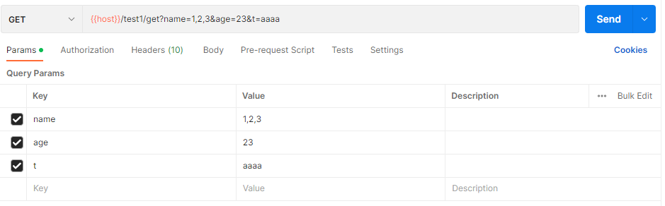
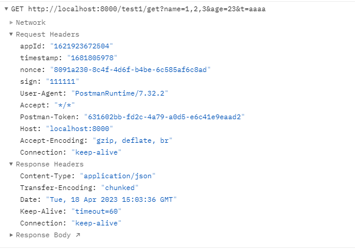
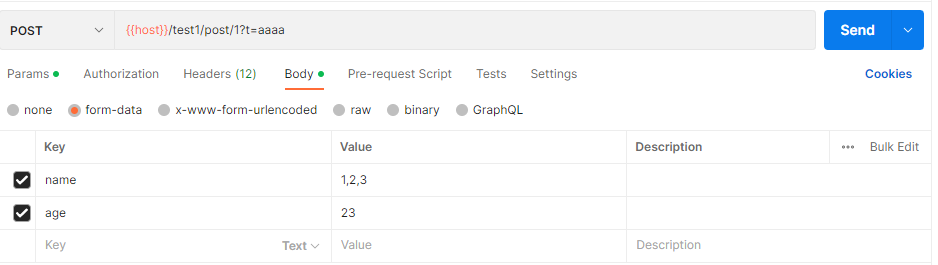
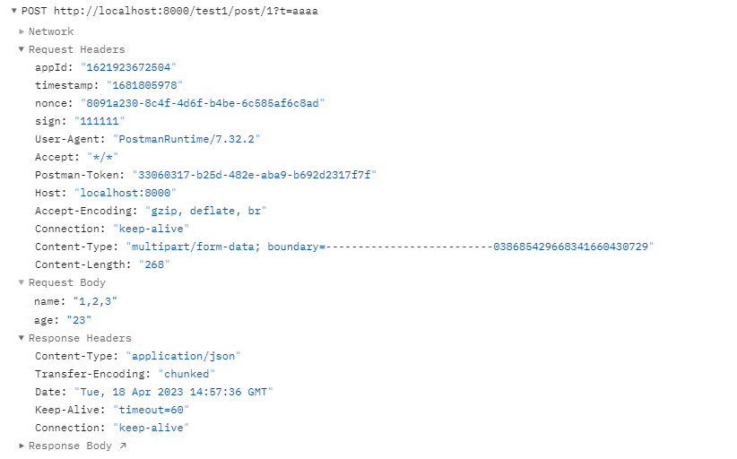
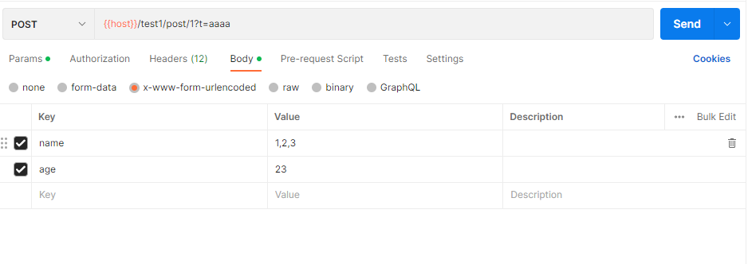
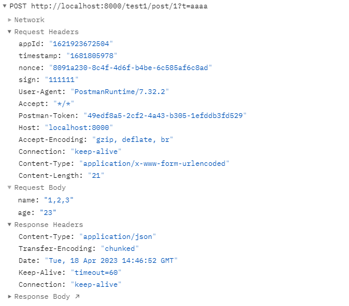
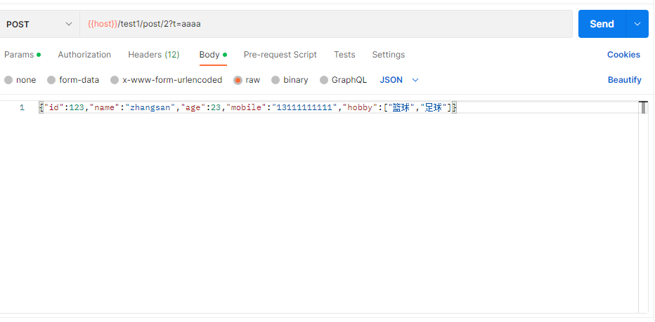
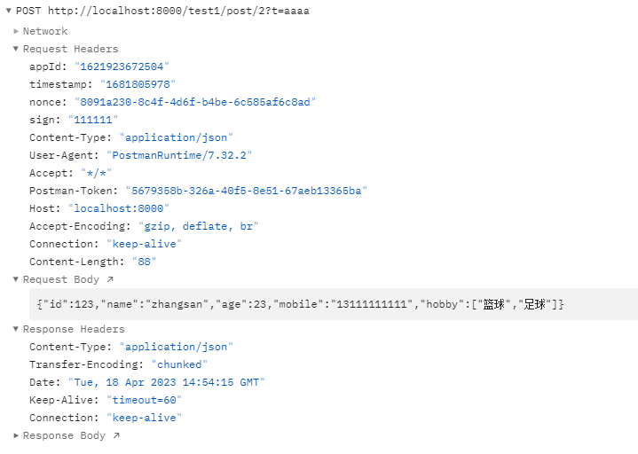

# SpringBoot 接口数据签名组件

### 概述

此组件支持query、form、json表单签名<br>
请求头需添加以下参数<br>

| 参数名称  | 必填 | 说明                          | 示例                                 |
| --------- | ---- | ----------------------------- | ------------------------------------ |
| appId     | 是   | 应用Id                        | 1621923672504                        |
| timestamp | 是   | 请求时间戳（秒）              | 1681805978                           |
| nonce     | 是   | 每次请求随机生成，需全局唯一 | 8091a230-8c4f-4d6f-b4be-6c585af6c8ad |
| sign      | 是   | 签名                          | ee242f43922dc3f70383a1c17ecaf169     |

### 依赖

```xml

<dependency>
    <groupId>io.github.douyayun</groupId>
    <artifactId>signature-body-spring-boot-starter</artifactId>
    <version>1.0.4</version>
</dependency>
```

#### `property`配置

```
# signature
signature.debug=false
signature.enabled=true
signature.timestamp-enabled=true
signature.include-paths=/test1/**,/test2/**
signature.exclude-paths=/echo/**
signature.secret-storage-type=redis
signature.secret[0].app-id=1621923672504
signature.secret[0].app-secret=f8c30adb67b14bc6a53b29b1de01b150
signature.secret[1].app-id=1621923672505
signature.secret[1].app-secret=f8c30adb67b14bc6a53b29b1de01b150
# redis
spring.redis.host=127.0.0.1
spring.redis.port=6379
spring.redis.password=123456
spring.redis.database=0
```

### 秘钥外部初始化：

```
import io.github.douyayun.signature.properties.SignatureProperties;
import io.github.douyayun.signature.storage.SecretStorage;
import lombok.extern.slf4j.Slf4j;
import org.springframework.beans.factory.annotation.Autowired;
import org.springframework.boot.CommandLineRunner;
import org.springframework.stereotype.Component;

import java.util.ArrayList;
import java.util.List;

/**
 * 初始化秘钥信息
 *
 * @author houp
 * @since 1.0.0
 **/
@Component
@Slf4j
public class InitSignatureSecretRunner implements CommandLineRunner {

    @Autowired
    private SecretStorage secretStorage;

    @Override
    public void run(String... args) {
        List<SignatureProperties.Secret> secrets = new ArrayList<>();
        SignatureProperties.Secret secret = new SignatureProperties.Secret();
        secret.setAppId("1621923672504");
        secret.setAppSecret("f8c30adb67b14bc6a53b29b1de01b150");
        secrets.add(secret);
        secretStorage.initSecret(secrets);
        // secretStorage.appendSecret(secret);
        // secretStorage.getSecret("1621923672504");
        // secretStorage.getAllSecret();
        // secretStorage.removeSecret("1621923672504");
        // secretStorage.removeAllSecret();
    }

}
```

### sign签名规则：

```
 String noSign = appId + timestamp + nonce + parameterData + jsonData + appSecret;
 String sign = Md5(noSign);
```

1、parameterData为请求参数包含url中的query和form表单中的参数，并按照参数名ASCII码从小到大排序，按照key=value的格式生成键值对（即key1=value1&key2=value2&key3=value3）拼接成字符串parameterData<br>
2、jsonData为请求体中的json数据，此数据原封不动的通过接口传递至接口中<br>

### sign签名示例：

| 参数名称  | 说明                           | 示例值                               |
| --------- | ------------------------------ | ------------------------------------ |
| appId     | 应用Id                         | 1621923672504                        |
| timestamp | 请求时间戳（秒）               | 1681805978                           |
| nonce     | 每次请求随机生成，需要全局唯一 | 8091a230-8c4f-4d6f-b4be-6c585af6c8ad |
| appSecret | 应用秘钥                       | f8c30adb67b14bc6a53b29b1de01b150     |

#### (1)、get请求

http://localhost:8000/test1/get?name=1,2,3&age=23&t=aaaa



```
待签名字符串：162192367250416818059788091a230-8c4f-4d6f-b4be-6c585af6c8adage=23&name=1,2,3&t=aaaaf8c30adb67b14bc6a53b29b1de01b150
签名：789726dea11c827f65e66981362a0d1a
```

#### (2)、post请求 form-data

http://localhost:8000/test1/post/1?t=aaaa




```
待签名字符串：162192367250416818059788091a230-8c4f-4d6f-b4be-6c585af6c8adage=23&name=1,2,3&t=aaaaf8c30adb67b14bc6a53b29b1de01b150
签名：789726dea11c827f65e66981362a0d1a
```

#### (3)、post请求 x-www-form-urlencoded

http://localhost:8000/test1/post/1?t=aaaa



```
待签名字符串：162192367250416818059788091a230-8c4f-4d6f-b4be-6c585af6c8adage=23&name=1,2,3&t=aaaaf8c30adb67b14bc6a53b29b1de01b150
签名：789726dea11c827f65e66981362a0d1a
```

#### (4)、post请求 application/json

http://localhost:8000/test1/post/2?t=aaaa



```
待签名字符串：162192367250416818059788091a230-8c4f-4d6f-b4be-6c585af6c8adt=aaaa{"id":123,"name":"zhangsan","age":23,"mobile":"13111111111","hobby":["篮球","足球"]}f8c30adb67b14bc6a53b29b1de01b150
签名：22c6d0584016bd2a5937b5b95cc06c87
```

### 特别注意以下重要规则：

◆ 参数名ASCII码从小到大排序（字典序）<br>
◆ 参数名区分大小写<br>

### 工具

https://the-x.cn/cryptography/Sm2.aspx